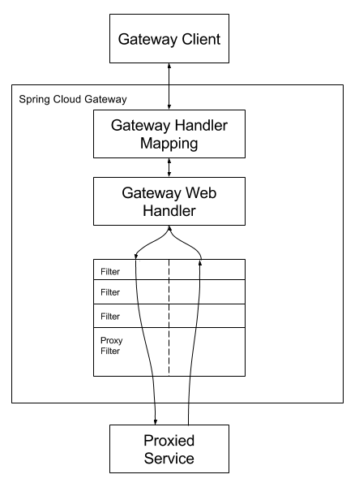

## Spring Cloud Gateway是什么？
网关作为流量的入口，常用的功能包括路由转发，权限校验，限流等。
Spring Cloud Gateway是Spring Cloud官方推出的第二代网关框架，定位于取代Nextifix Zuul。相比于Zuul来说，Spring Cloud Gateway提供了更优秀的性能，更强大的功能。
Spring Cloud Gateway是由WebFlux+Netty+Reactor实现的响应式的API网关。它不能在传统的servlet容器中工作，也不能构建成war包。

## Spring Cloud Gateway有哪些核心概念？
- 路由 Route
路由是网关中最基础的部分，路由信息包括一个ID、一个目的URI、一组断言工厂、一组Filter组成。如果断言为真，则说明请求的URL和配置的路由匹配。
- 断言 predicate
Java8中的断言函数，SpringCloud Gateway中的断言函数类型是Spring5.0框架中的ServerWebExchange。断言函数允许开发者去定义匹配Http request中的任何信息，比如请求头和参数等。
- 过滤器 filter
SpringCloud Gateway中的filter分为Gateway FilIer和Global Filter。Filter可以对请求和响应进行处理。

## Spring Cloud GateWay的工作流程是什么？
Spring Cloud Gateway 的工作原理跟 Zuul 的差不多，最大的区别就是 Gateway 的 Filter 只有 pre 和 post 两种。
客户端向 Spring Cloud Gateway 发出请求，如果请求与网关程序定义的路由匹配，则该请求就会被发送到网关
Web 处理程序，此时处理程序运行特定的请求过滤器链。过滤器之间用虚线分开的原因是过滤器可能会在发送代理请求的前后执行逻辑。所有 pre 过滤器逻辑先执行，然后执行代理请求；代理请求完成后，执行 post 过滤器逻辑。

